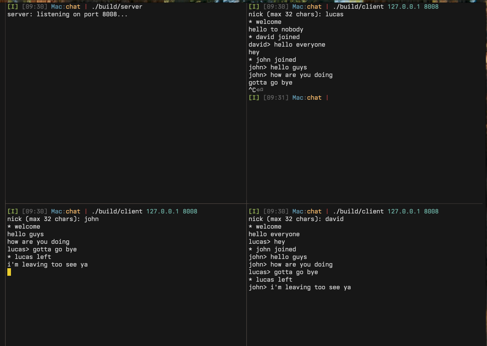

# tcp-chat-c

Multithreaded TCP chat server and client in C with a length-prefixed binary protocol.

## Build

```sh
make          # builds build/server and build/client
make clean
```

Requires a C23 compiler and `pthread`.

## Run

```sh
./build/server                     # listens on port 8008
./build/client <host> <port>       # e.g. ./build/client localhost 8008
```

The client prompts for a nick, then reads lines from stdin and prints incoming messages.

## How it works

- **Server** — one thread per connection (reader), plus a paired writer thread that drains a per-connection send queue. Broadcast is fan-out over the registry of active connections, guarded by a mutex.
- **Client** — one thread reads frames from the socket and prints them; the main thread reads stdin and sends `SAY` frames.
- **Wire format** — every message is a length-prefixed frame: `[u16 len][u8 tag][payload]`. Tags: `NICK`, `SAY` (client→server); `TEXT`, `JOIN`, `PART`, `OK`, `ERR` (server→client). See `proto.h`.
- **Handshake** — client sends `NICK`; server replies `OK` on success or `ERR` (taken / invalid / full) and retries up to 5 times.

## Files

| File | Purpose |
| --- | --- |
| `server.c` / `client.c` | entry points |
| `chat.c` | connection registry, handshake, broadcast |
| `conn.c` | per-connection state (framer + send queue + nick) |
| `proto.c` | encode/decode of `Msg` ↔ bytes |
| `framer.c` | read/write full frames over a socket |
| `packet.c` | ref-counted encoded frame, shared across broadcasts |
| `sendq.c` | bounded blocking queue for the writer thread |
| `net.c` | `listen_socket` / `connect_socket` helpers |
| `buf.h`, `cursor.h`, `writer.h`, `check.h` | small header-only utilities |

## Demo


